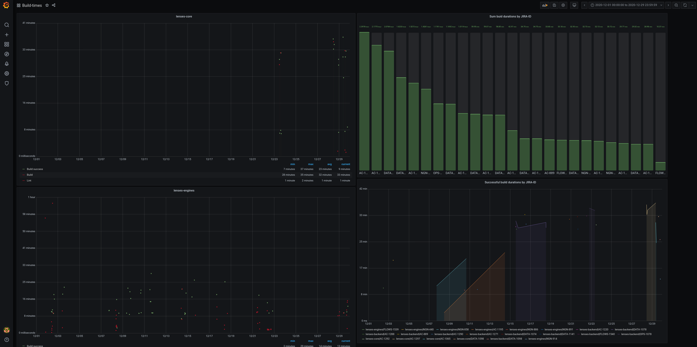

## Buildtimes

Simple CLI app to extract project build time metrics from Github and sink them into 
an RDBMS (i.e. currently Postgres).

### Development status

This project is not production ready and is still pre-alpha quality! Beware!

### Usage

```bash
 sbt 'run --repo org/repo1 \
          --repo org/repo2 \
	  --github-creds username:$GH_TOKEN\
	  --jdbc-url jdbc:postgresql://localhost/$DBNAME?user=pguser&password=$PGPASSWORD'
```

### Grafana dashboards

Once ingested into Postgres, the buildtimes data can be visualised in a Grafana dashboard:



In order to so, you will have to:
- add Postgres as a Grafana datasource (note: if using the `docker-compose.yml` in this project, you will have to set the db host to `postrges` as using `localhost` won't work!)
- importing [this dashboard specification](grafana/dashboard.json).
